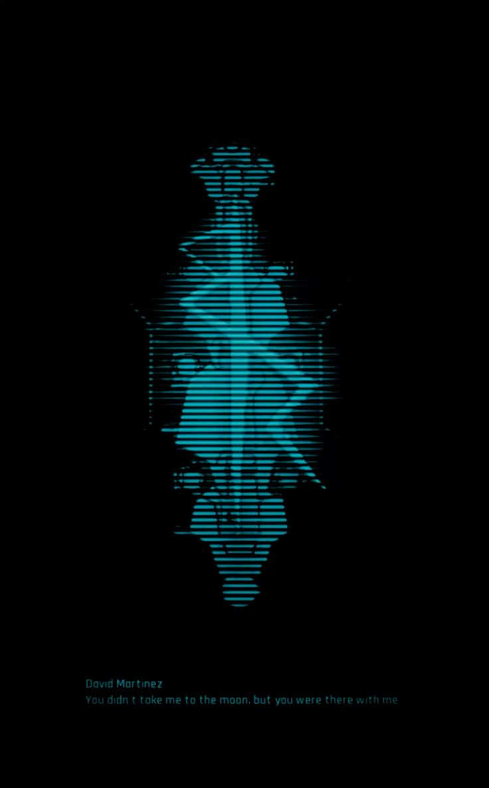

<p align="center">
  
</p>

<p align="center">
  
</p>

<p align="center">
  
</p>

---


```bash
$ whoami
K Nagendra Pai


$ role
AI & Agentic Systems Engineer

$ specialization
Agentic AI • Multi-Agent Orchestration • Full-Stack • Machine Learning

$ current_status
Building scalable and intelligent systems
```
## Tech Stack

### 🤖 Agentic AI & LLM Systems
<p>
  
  
  
  
  
  
  
</p>

### 🧠 Machine Learning & Deep Learning
<p>
  
  
  
  
  
</p>

### 💻 Full-Stack & Languages
<p>
  
  
  
  
  
  
</p>

### 🗄️ Databases & ORM
<p>
  
  
  
  
</p>

### ⚙️ DevOps, Runtimes & Analytics
<p>
  
  
  
  
  
</p>

### 🎮 Other Technologies
<p>
  
  
  
</p>


## Current Focus

- Architecting production multi-agent systems with LangGraph, LangChain & MCP
- Full-stack GenAI SaaS development using FastAPI, React & SQLAlchemy
- Observability and deterministic LLM evaluation (Langfuse, Constraint Decoding)
- Edge LLM integration and computer vision pipelines (Ollama, OpenCV)
- Exploring game development using Godot
- Working with embedded systems and IoT


## GitHub Analytics

<table width="100%">
<tr>

<td width="65%">

<br><br>

<!-- <br><br>

 -->

</td>

<td width="35%" align="right" valign="top">



</td>

</tr>
</table>


## Current Activity
```
[+] Engineering multi-agent pipelines (LangGraph & MCP)
[+] Developing full-stack SaaS with FastAPI & React
[+] Implementing agent observability with Langfuse
[+] Exploring game development in Godot
[+] Optimizing deterministic LLM execution & RAG
```

## Philosophy
```
First make it work.
Then make it efficient.
Then make it scalable.
```

<p align="center">
  
</p>

